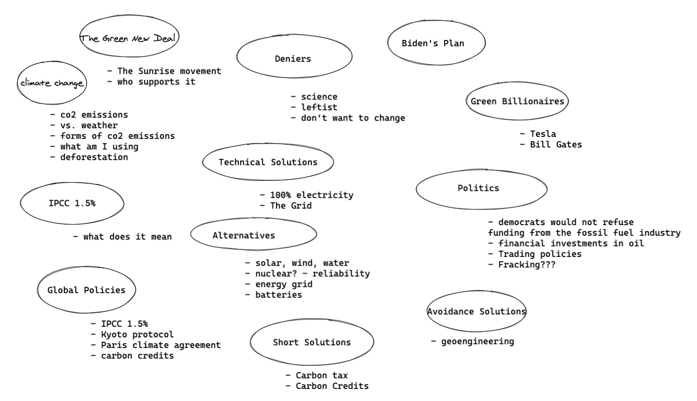
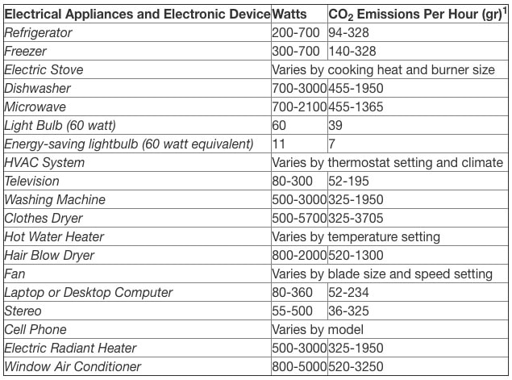
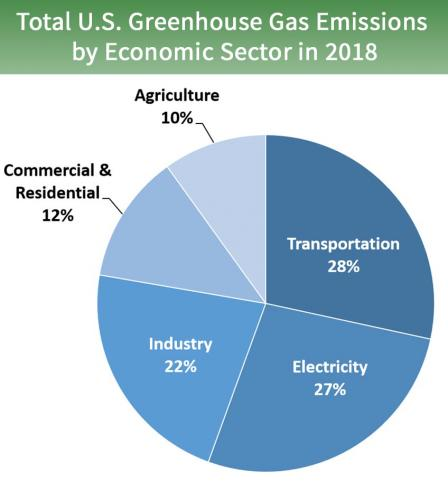

This is the beginning of a series of posts related to my learnings on Climate Change. Here's a brief overview diagram of the sections I'm hoping to look into. I know, there's a lot of ground to cover and admittedly I might just be tapping the surface on some of these topics, but know that we can always dive into a topic even more at later time! Many of the items intersect but I'll try to go through them in an order that allows us to see how they affect each other. Remember, the overall goal is to get a better understanding of what I can/should be doing to help solve this issue.
 
 

 

I want to start this off by ironing out some basic questions that I had about climate change:
 

**What is Climate Change?**

Climate change describes a change in the average weather patterns (temperature, rainfall etc) in a region over a long period of time. It can be thought of as the weather averaged over several seasons, years or decades. Often times people might say "climate change isn't real because it's still snowing where I live" - they are describing the weather. Weather refers to atmospheric conditions that occur locally over short periods of time—from minutes to hours or days. Examples include rain, snow, clouds, winds, floods or thunderstorms. Mainly: the difference between climate and weather is the length of timescales involved.

**What is Global Warming?**

Global warming describes the long-term heating of Earth's climate system due to human activities. The primary cause is burning fossil fuels which increases the greenhouse gas levels in Earth's atmosphere.

**What are Greenhouse Gases?**

Greenhouse gases are any gaseous compound in the atmosphere that's capable of absorbing infrared radiation which traps and holds heat in the atmosphere. They make Earth much warmer than it would be without them in the atmosphere (it'd be an average temperature of 0 °F vs the present average of 59 °F). The greenhouse gas effect is one of the things that makes Earth a comfortable place to live, but since the beginning of the Industrial Revolution around 1750, there has been a 45% increase of atmospheric concentration of carmon dioxide in the atmosphere resulting in "Global Warming".

Here's a breakdown of greenhouse gas emissions in 2018 from the EPA (U.S. Environmental Protection Agency):

Carbon Dioxide (CO2) - 81%

- through burning fossil fuels (coat, natural gas and oil), solid waste, trees, and other biological materials, and also as a result of certain chemical reactions.
- Carbon dioxide is removed from the atmosphere (or "sequestered") when it is absorbed by plants as part of the biological carbon cycle.

Methane (CH4) - 10%

- emitted during the production and transport of coal, natural gas, and oil
- also result from livestock and other agricultural practices and by the decay of organic waste in municipal soldi waste landfills

Nitrous Oxide (N2O) - 7%

- emitted during agricultural and industrial activities, combustion of fossil fuels and solid waste, as well as during treatment of wastewater.

Fluorinated gases - 3%

- fluorinated gases have no natural sources and only come from human-related activities. They are emitted through their use as substitutes for ozone-depleting substances (e.g., as refrigerants) and through a variety of industrial processes such as aluminum and semiconductor manufacturing. Many fluorinated gases have very high global warming potentials (GWPs) relative to other greenhouse gases, so small atmospheric concentrations can have disproportionately large effects on global temperatures. They can also have long atmospheric lifetimes—in some cases, lasting thousands of years

**How long do they stay in the atmosphere?**

- each of these gases can remain in the atmosphere for different amounts of time, ranging from a few years to thousands of years.
- All of these gases remain in the atmosphere long enough to become well mixed, meaning that the amount that is measured in the atmosphere is roughly the same all over the world, regardless of the source of the emissions. So emissions coming from China will impact the U.S. regardless of the many miles between the two countries.

**What am I emitting?**

aka what am I using that emits a greenhouse gas? Some examples include: my car, water heater, refrigerator, freezer, HVAC system, washing machine, clothes dryer etc...

A study from the Norwegian University of Science and Technology has provided CO2 emissions estimates for household appliances and electronics. Their research includes evaluations of total greenhouse emissions, including from manufacturing, usage, and disposal of each home appliance and electronic device.

 

**What do I own that was made in a factory that emits a greenhouse gas?**

Mostly everything I own... my cell phone, laptop, clothes, etc.

**What do I consume that causes greenhouse gas emissions?**

Farming livestock: cow, lamb, pigs, chickens - all contribute around 6 billion tonnes of greenhouse gases (carbon dioxide, methane and nitrous oxide) to the atmosphere each year
 
 

**Here is a breakdown of the percentage of emissions related to each sector:**

 

Long story short, humans are outputting enormous amounts of these greenhouse gases by burning fossil fuels, cutting down rainforests (which absorb CO2), and farming livestock. Our way of living has been producing output that negatively impacts the environment we are living in. And I mean this collectively as a whole, but also individually: **my everyday living is producing negative output** even though I can't see the output. This obviously means something we're doing needs to change. When we talk about change we usually start by thinking about what I can change (after-all we have the most control over ourselves). But I'm going to go ahead and say that I can't just stop using my home appliances or my car because I need them to survive. Granted I can adjust my usage of them and the number of purchases I make, but it will not be enough to actually make a difference in the grand scheme of things.

So then... what are my options? To understand what I can do to take responsibility and make some changes happen, I also need to have an understanding of what the/an "ideal" solution is. And in order to do that we'll need to look into all the factors at play alongside all the players at the table. Let's start with the most important and the most impacted: the Earth. Specifically, what state is it in now, what state does it need to be in for it to not change dramatically, and what's going to happen to it if we don't change anything at all?
