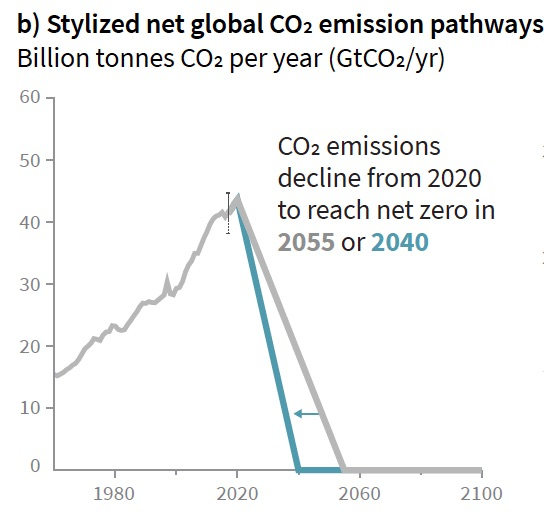

I feel like I hear "1.5°C" all the time when reading or watching videos about climate change but I have no idea what it actually means or where this number came from. The general knowledge I do know is that if/when we reach this 1.5°C increase, bad things are going to happen and we are unfortunately not currently on the path to stay below 1.5°C.

First things first, what does this number mean?

Plainly, 1.5°C refers to the increase in the average global surface temperature compared to pre-industrial times (reference period 1850–1900 to represent pre-industrial temperature). It was first mentioned in the Cancun Agreement and adopted at the sixteenth COP (COP16) in 2010. In 2016, with the adoption of the Paris Agreement, the UNFCCC invited the IPCC to provide a Special Report in 2018 on ‘the impacts of global warming of 1.5°C above pre-industrial levels and related global greenhouse gas emissions pathways’. The IPCC accepted the invitation and produced a series of reports, one of which was the 1.5-Degree Special Report (SR1.5).

IPCC stands for the International Panel on Climate Change and is essentially the United Nations body for accessing the science related to climate change. It was originally created in 1988 by the World Meteorological Organization (WMO) and the United Nations Environment Programme (UNEP) with the objective to provide policymakers with regular scientific assessments climate change, its implications and potential future risks, as well as to put forward adaptation and mitigation options.

The IPCC website states that "Thousands of people from all over the world contribute to the work of the IPCC. For the assessment reports, IPCC scientists volunteer their time to assess the thousands of scientific papers published each year to provide a comprehensive summary of what is known about the drivers of climate change, its impacts and future risks, and how adaptation and mitigation can reduce those risks. An open and transparent review by experts and governments around the world is an essential part of the IPCC process, to ensure an objective and complete assessment and to reflect a diverse range of views and expertise...The IPCC does not conduct its own research."

The 1.5-Degree Special Report is split into 4 main sections: Understanding Global Warming of 1.5°C, Projected Climate Change & Potential Impacts and Associated Risks, Emission Pathways and System Transitions Consistent with 1.5°C Global Warming, and Strengthening the Global Response in the Context of Sustainable Development and Efforts to Eradicate Poverty. I will not be covering the report (it's linked down below under Sources) but will be summarizing and taking bits out of it to get a better understanding of where we currently stand and what dangers are ahead.

 

According to an analysis conducted by scientists at NASA’s Goddard Institute for Space Studies (GISS), the average global temperature on Earth has increased by ~1° Celsius (2° Fahrenheit) since 1880, with two-thirds of the warming occurring since 1975 at roughly 0.15-0.20°C per decade. If it continues at this current rate, the increase in the average global surface temperature is likely to reach 1.5°C as early as 2030. Although we have not yet hit 1.5°C , we can already feel the impacts of this 1°C warming in many parts of the world:

- There is an overall decrease in the number of cold days and nights and overall increase in the number of warm days and nights at the global scale on land
- Ice is melting worldwide (mountain glaciers, ice sheets covering West Antarctica and Greenland, and Arctic sea ice. In Montana's Glacier National Park the number of glaciers has declined to fewer than 30 from more than 150 in 1910.
- Melting ice causes the sea level to rise. Global sea levels are rising 0.13 inches (3.2 millimeters) a year, and the rise is occurring at a faster rate in recent years. Sea levels are expected to rise between 10-32 inches or higher by the end of the century.
- Many specifies (butterflies, foxes etc) are on the move because temperatures are changing, moving farther north or higher to cooler areas. Other species such as mosquitoes, tickets, jellyfish and crop pests are actually thriving.
- Precipitation (rain and snowfall) has been increasing across the globe in some regions, while others have been experiencing more severe drought. This can result in risk of wildfires, lost crops, and drinking water shortages.
- Ocean pH has decreased by 0.1 pH units since the pre-industrial period. About 30% of CO2 emitted by human activities has been absorbed by the upper layers of the ocean, where it has combined with water to produce a dilute acid that dissociates and drives ocean acidification.

The IPCC report states, "Extra warming on top of the ~ 1°C we have seen so far would amplify the risks and associated impacts, with implications for the world and its inhabitants. This would be the case even if the global warming is held at 1.5°C, just half a degree above where we are now, and would be further amplified at 2°C of global warming."

Essentially, all of the extreme weather events we have been experiencing lately will get worse as the average global temperature rises. We'll experience more dramatic temperature extremes (increased intensity and frequency of hot days and nights), heavy precipitation (increases in frequency, intensity and/or amount of heavy precipitation), drought and dryness (dryness trends in some regions: southern Europe, northern Africa, and Near East), runoff and river flooding (increase in flood frequency with significant increase in runoff and tropical cyclones.

You can think of the concept in reverse as well: the lower the rise in global temperature above pre-industrial levels, the lower the risks to human societies and natural ecosystems:

- The number of people exposed to increased flooding in 2050 under warming of about 1.5°C could be reduced by 26–34 million compared to the number exposed to increased flooding associated with 2°C of warming.
- Exposure to the increase in water scarcity in 2050 will be globally reduced by 184–270 million people at about 1.5°C of warming compared to the impacts at about 2°C.

It's important to note that the impacts of increased temperature are affecting different parts of the world differently. Since the temperatures we're measuring are an average, it means that some parts of the world will reach higher than 1.5°C and therefore experience even higher risks.

I wanted to briefly add in how the rising waters might affect our cities. I find there is something extremely real and demanding about knowing that a place that we thought would always be might be swallowed by nature in our lifetime. The New York Times published an article in 2019 showing old vs. new projections of what specific cities will look like in 2050 (link in Sources), mainly stating that rising seas could affect three times more people by 2050 than previously thought.

Here's an example from their article:
 

 

To make it more relatable, here are some U.S. cities that might be underwater in the next 30+ years (2050+)

- Miami Beach, Florida
- Hoboken, New Jersey
- Atlantic City, New Jersey
- Key West, Florida
- Galveston, Texas
- Hilton Head Island, South Carolina
- Chesapeake, Virginia
- Long Beach, New York

etc...

**Where are we now?**

As you probably know, we're not in a good, relastic place to stay below 1.5˚C. We would need to cut emissions by 15% every year starting in 2020 until they hit net zero, and that is probably not going to happen given our past history.

Had we started steadily reducing emissions 20 years ago when we knew about climate change, we would be in a much more relastic position to hit our target. Unfortunately, we actually emitted more emissions every year (except for 2020, thanks to covid) which means we are most certainly going to go over 1.5˚C and be closer to 2˚C.

Now knowing the consequences of going above 1.5˚C it seems like we should all be scrambling to do something about it. But why isn't the government doing anything? And why haven't we been doing things already if we've known about climate change for so long?
