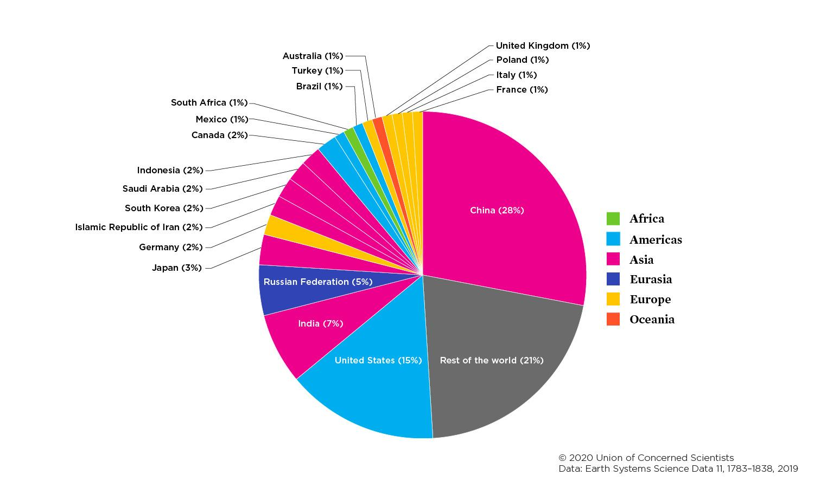
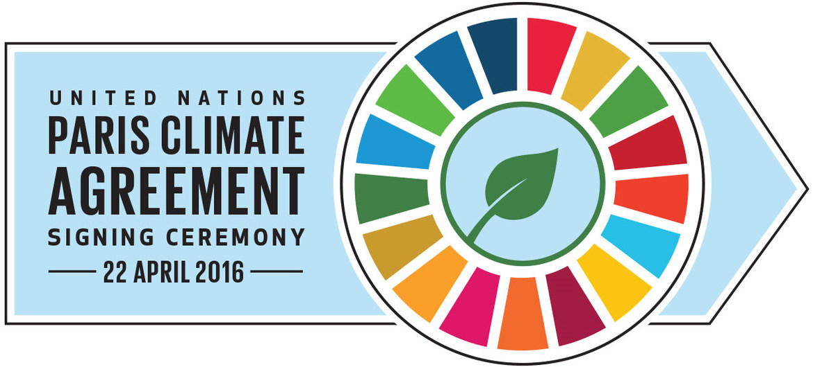
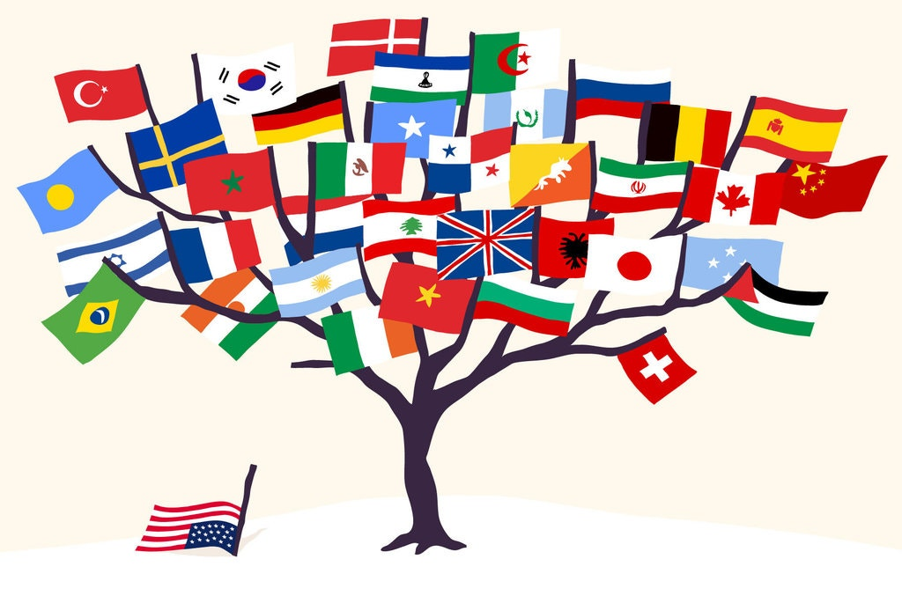
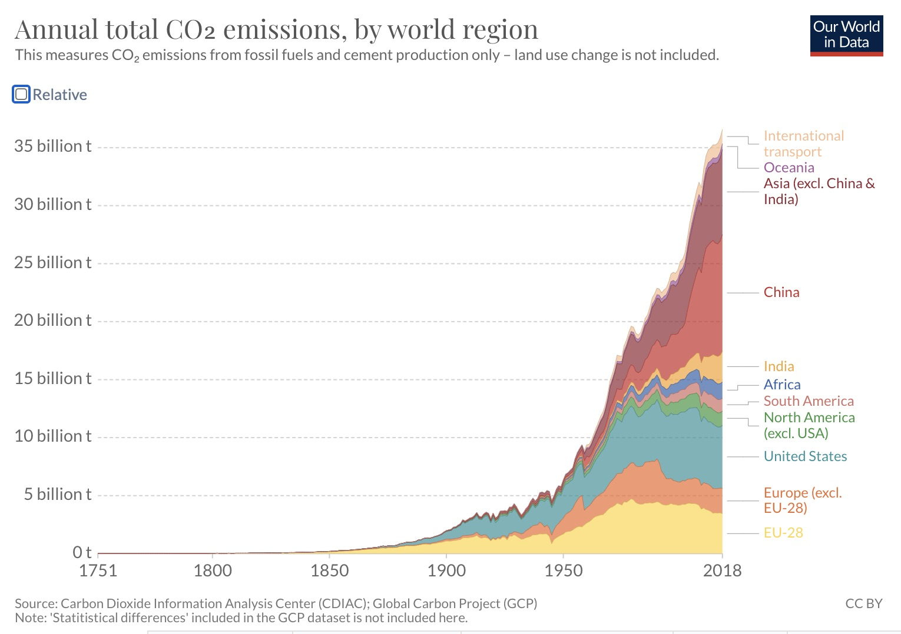

We have established an understanding that climate change is a global problem that is going to affect every single country on Earth, so what are our governments doing about it on a global scale? Surprisingly, or maybe unsurprisingly, the first international treaty focused on reducing greenhouse gases was established not that long ago, and there have only been 2 established global policies to date:

### The Kyoto Protocol

In 1992, the United Nations Framework Convention on Climate Change was negotiated and signed by 154 states at the United Nations Conference on Environment and Development held in Rio de Janeiro. This convention was the first demonstration that the world acknowledged that there is a human-induced climate change problem and its purpose was to encourage industrialized countries to stabilize their green house gas emissions.

In 1997, the Conference of the Parties to the UNFCCC was held in Kyoto, Japan and the Kyoto Protocol was created as an extension to the UNFCCC. It was the first international treaty on controlling and reducing greenhouse gases and entered into force in 2005. Its aim was to make sure that all countries that signed up for Kyoto Protocol would reduce their green house gas emissions.

The principle that it carried was "common but differentiated responsibilities", splitting the efforts into 2 main groups: developed countries and developing countries. Developed countries consisted of countries with 150+ years of industrial activity and thus needed to reduce their emissions. While developing countries had lower emissions so they did not need to commit to reducing their ghg (greenhouse gases) emissions and were asked to comply voluntarily. Ironically China and India (and 100+ developing countries) were exempted from the Kyoto agreement. More specifically the Protocol split countries into 3 categories:

**Annex I countries –** industrialized countries and economies in transition, this consisted of 40 countries plus the EU: Australia, Austria, Belarus, Belgium, Bulgaria, Canada, Croatia, Czech Republic, Denmark, Estonia, Finland, France, Germany, Greece, Hungary, Iceland, Ireland, Italy, Japan, Latvia, Liechtenstein, Lithuania, Luxembourg, Monaco, Netherlands, New Zealand, Norway, Poland, Portugal, Romania, Russian Federation, Slovakia, Slovenia, Spain, Sweden, Switzerland, Turkey, Ukraine, United Kingdom, United States of America.

**Annex II countries –** developed countries which pay for costs of developing countries, this consisted of 23 countries: Australia, Austria, Belgium, Canada, Denmark, Finland, France, Germany, Greece, Iceland, Ireland, Italy, Japan, Luxembourg, Netherlands, New Zealand, Norway, Portugal, Spain, Sweden, Switzerland, United Kingdom, United States of America

And **developing countries -** which are not required to reduce emissions unless developed countries supply fundinng and techonlogy.

The goals for the developed countries was to lower overall emissions from a group of six greenhouse gases by 5.2% over specified commitment periods, measured against a base year of 1990. Each country had a different target percentage depending on their calculated emissions: US: 7%, EU: 8%, Canada: 6%. The first commitment period was of 5 years from 2008-2012 and involved 37 industrialized nations. The second was set to be 2013-2020.

**How were countries going to achieve their goals?**

The Protocol defines three "flexibility mechanisms" that can be used by the developed countries to meet their target emissions: International Emissions Trading (IET), the Clean Development Mechanism (CDM) and Joint Implementation (JI).

The CDM and JI are called "project-based mechanisms," in that they generate emission reductions from projects, whereas IET is based on the setting of a quantitative restriction of emissions, while the CDM and JI are based on the idea of "production" of emission reductions

> **International Emissions Trading** **(IET)** - each country gets assigned units (Assigned Amount Unit), they're supposed to emit this much ghg during this commitment period. If a country exceeds its limits, it will need to buy carbon credits from other countries who are under - generally developing countries.

> - One of the problems with IET is that many countries (Belarus, Bulgaria, Croatia, Czech Republic, Estonia, Hungary, Latvia, Lithuania, Poland, Romania, Russia, Slovakia, Slovenia, and Ukraine) had a surplus of allowances, regarded as potential compensation for the trauma of their economic restructuring. This surplus of credits meant emissions were not being reduced as much as expected.

> **Clean Development Mechanism** (**CDM)** - provides for emissions reduction projects which generate Certified Emission Reduction units (CERs) which may be traded in emissions trading schemes. The purpose of the CDM is to promote clean development in developing countries, i.e., the "non-Annex I" countries. The CDM is one of the Protocol's "project-based" mechanisms, in that the CDM is designed to promote projects that reduce emissions.

> An industrialized country that wishes to get credits from a CDM project must obtain the consent of the developing country hosting the project and their agreement that the project will contribute to sustainable development.

> **Joint Implementation (JI)** - Any Annex I country can invest in a project to reduce greenhouse gas emissions in any other Annex I country (referred to as a "Joint Implementation Project") as an alternative to reducing emissions domestically. In this way countries can lower the costs of complying with their Kyoto targets by investing in projects where reducing emissions may be cheaper and applying the resulting Emission Reduction Units (ERUs) towards their commitment goal.

> **Financial Commitments:**
> The Protocol also reaffirms the principle that developed countries have to pay billions of dollars and supply technology to other countries for climate-related studies and projects. The principle was originally agreed in UNFCCC.
> An example is The Adaptation Fund, which has been established by the Parties to the Kyoto Protocol of the UN Framework Convention on Climate Change to finance concrete adaptation projects and programmes in developing countries that are Parties to the Kyoto Protocol.

**U.S. Involvement:**

During the Clinton Administration, Vice President Al Gore was a main participant in putting the Kyoto Protocol together. In 1997 President Clinton signed the Kyoto Protocol but the U.S. Senate refused to ratify it. They then passed a resolution declining to ratify any treaty which mandates new commitments to limit or reduce emissions for developed countries, unless commitments are also mandated for developing countries; or would cause serious harm to the U.S. economy. In 2001 President Bush opposes Kyoto Protocol and withdraws the U.S. signature, arguing that the division between developed and developing countries was unfair, and the cost of following the Protocol's requirements would stress the economy. When Obama became President he was expected to take action and help battle global climate change, however he too refused to sign the Kyoto Protocol for reasons similar to those before him. This ensured the Kyoto Protocol would run out in 2012.

On December 12, 2011 Canada officially renounced the Kyoto Protocol. Environment Minister Peter Kent says Kyoto’s goals are unworkable because the United States and China never agreed to Kyoto, and that a new pact is needed to address emissions. The Kyoto Protocol seemingly fizzled out and was then superseded by the Paris Agreement.

 

## The Paris Agreement

In December of 2015, all Parties of the UNFCCC reached a climate change mitigation and adaptation agreement, called The Paris Agreement, which entered into force on November 4, 2016. The Paris Agreement is a **legally binding international treaty** with a goal to limit global warming below a 2°C increase above pre-industrial temperatures. As of June 2020, the Paris Agreement had 197 signatories of which 189 parties accounting for at least 55% of total global emissions have ratified the agreement (including the U.S. and China). In June 2017, President Trump announced that the U.S. would withdraw from the Paris Agreement. The withdrawal took place on November 4, 2020 but thankfully at the beginning of his presidency, President Biden reentered the U.S. into the Paris Climate Agreement.

The Paris Agreement works on a 5-year cycle of increasingly ambitious climate action carried out by countries. By 2020, countries submit their plans for climate action known as **nationally determined contributions (NDCs)**. In their NDCs, countries communicate actions they will take to reduce their Greenhouse Gas emissions in order to reach the goals of the Paris Agreement as well as what actions they will take to build resilience to adapt to the impacts of rising temperatures. Then in 2024 they will report transparently on actions taken. For efforts towards the long-term goal, the Paris Agreement invites countries to formulate and submit long-term low greenhouse gas emission development strategies (LT-LEDS) by 2020. LT-LEDS provide the long-term horizon to the NDCs. Unlike the NDCs, they're not mandatory, but they hope to place the NDCs into the context of countries’ long-term planning and development priorities, providing a vision and direction for future development.

Despite being mandatory, the 'contributions' themselves are not binding as a matter of international law. There will be no mechanism to force a country to set a target in their NDC by a specific date and no enforcement if a set target in an NDC is not met. There will only be a "name and shame" system.

Unlike its predecessor, the Kyoto Protocol, which sets commitment targets that have legal force, the Paris Agreement, with its emphasis on consensus-building, allows for voluntary and nationally determined targets. The specific climate goals are thus politically encouraged, rather than legally bound. Only the processes governing the reporting and review of these goals are mandated under international law. This structure is especially notable for the United States— since there are no legal mitigation or finance targets, the agreement is considered an "executive agreement rather than a treaty". If you recall from earlier, in 1997 when President Clinton signed the Kyoto Protocol, the U.S. Senate refused to ratify it and passed a resolution declining to ratify any treaty which mandates new commitments to limit or reduce emissions for developed countries. This was specifically made as an agreement so the U.S. president could join without seeking congressional approval.

### U.S. Influence

Given that there is no mechanism to force a country to carry out their plans and meet their targets, the influence the United States has plays a large part in this agreement. This is why it was such a big deal when President Trump withdrew from the Paris Agreement. This agreement relies on large world powers to set an example and provide peer pressure to get other countries to commit to their own targets. Without the U.S., the agreement is in an extremely fragile state and could easily crumble if more and more countries pull out.

 
 

## GENERAL POLICIES

Most green policies fall into one of these types:

**Market-based Instruments**

- carbon taxes, subsidies and cap-and-trade programs
- tradable carbon permit systems, permits equal to an allowed level of emissions are distributed or auctioned. Parties with emissions below their allowance are able to sell their excess permits to other parties that have exceeded their allowance.
- Market-based instruments are recognized for their potential to reduce emissions by allowing for flexibility and ingenuity in the private sector

**Regulatory Instruments**

- non-tradable permits, technology and emissions standards, product bans, government investment

**Voluntary Agreements**

- generally made between a government agency and one or more private parties to “achieve environmental objectives or to improve environmental performance beyond compliance.”
- ex: EPA partners with the public and private sectors to oversee a variety of voluntary programs aimed at reducing GHG emissions, increasing clean energy adoption, and adapting to climate change

## CHALLENGES

**Emissions Accounting System:** Any effort trying to reduce emissions runs into the problem of how should we measure and monitor how much carbon each country is emitting? Countries are currently only responsible for the pollution they create inside their own borders - not for the pollution produced in the manufacturing of goods that are shipped to their shores. This has distorted the picture of the drivers of global emissions, it has allowed de-industrializing wealthy states to claim that their emissions have stabilized or even gone down when in fact, their emissions have soared during the free trade era.

- International trade has allowed these countries to move their dirty production overseas
- Between 2002 to 2008, 48 percent of China's total emissions was related to producing goods for export

 

Who is responsible for what? Is it the countries that have emitted the most emissions over time (such as the EU and the U.S.) that should have the most responsibility today? Or countries that are currently emitting the most emissions today (such as China) that should be cutting back more?

**Free Trade/ Free Market Fundamentalism**

Green energy programs and free trade policies are constantly intersecting, but they seem to actively pretend that the other doesn't exist. Unfortunately, in most intersections, free trade has been allowed to override climate policy, whereas the opposite rarely happens.

**How does free trade affect green energy policies?**

It allows countries to move their dirty production overseas and favors high greenhouse gas emitting and extractive industries, like energy and agriculture, over environmental protection.

A good example is NAFTA (North America Free Trade Agreement), a treaty entered into by the United States, Canada, and Mexico; it went into effect on January 1, 1994. (Free trade had existed between the U.S. and Canada since 1989; NAFTA broadened that arrangement.) NAFTA was created to eliminate tariff barriers to agricultural, manufacturing, and services; to remove investment restrictions; and to protect intellectual property rights, thus encouraging "global" production and manufacturing.

Ben Lilliston, the director of rural strategies and climate change at the Institute for Agriculture and Trade Policy, states that NAFTA has been a major driver of climate change and has been known to protect the fossil fuel industry. One of the most highly criticized provisions of NAFTA is the Investor State Dispute System (ISDS). Under ISDS, private corporations can sue governments if they believe a new government policy treats them unfairly. Fossil fuel companies have used ISDS numerous times to sue governments over environmental protections.

The Trump administration recently created a successor to NAFTA called the U.S.-Mexico-Canada Agreement (USMCA). However, it still repeats past mistakes by ignoring climate change and disregarding the pact’s impact on GHG emissions. It empowers energy companies to legally challenge environmental protections, creates new venues for governments to weaken or block environmental regulations, and facilitates a North American system of energy, fuel and agriculture that are major sources of GHG emissions.

Green energy programs are increasingly being challenged under international trade agreements, particularly the World Trade Organization's rules. A great example of this happened in Ontario, Canada, outlined by Naomi Klein in her book "This Changes Everything: Capitalism vs. The Climate". In 2009, Ontario introduced the Green Energy and Green Economy Act intending to expand renewable energy production and create green jobs, centered on a pledge to wean the city completely off coal by 2014. The legislation created a feed-in tariff program, which allowed renewable energy providers to sell power back to the grid and offered long-term contracts with guaranteed premium price. The catch was in order to qualify, they had to ensure that a minimum percentage of their workforces and materials were local to Ontario. This "buy local, hire local" scheme makes it easier/possible to regulate how products are actually being produced. Many people, including LLana Solomon (the director of the Sierra Club Responsible Trade Program) believe this notion, stating, "In order to combat climate change, there's a real need to start localizing our economies again, and thinking about how and what we're purchasing and how it's produced. And the most basic rule of trade law is you can't privilege domestic over foreign...if we don't think about how the economy is structured, then we're actually never going to the real root of the problem".

And it turned out to be an undeniable success. By 2012 Ontario was the largest solar producer in Canada, and by 2013 they had only one working coal-fired power plant left. Unfortunately, Japan and the EU thenn let it be know that they considered Ontario's localized requirements to be a violation of WTO (World Trade Organization) rules. They claimed the requirement of a fixed percentage of renewable energy made in Ontario would "discriminate against equipment for renewable energy generation facilities produced outside of Ontario". The WTO determined that Ontario's buy-local provisions were illegal and ruled against Canada. From a legal standpoint, Japan and the EU were correct. This makes it obvious that something needs to change with our trade laws to allow for cooperation with green programs. Steven Shrybman, an international trade and public interest lawyer staetes, "If trade rules don't permit all kinds of important measures to deal with climate change - and they don't - then the trade rules obviously need to be rewritten".

## WHAT NOW

There are clearly some road blocks that need to be removed before we will be able to see more progress globally in reducing ghg emissions. Not to say that there haven't been improvements made, but there definitely needs to be more progress made if we are hoping to stay below 2°C. Now that the U.S. has rejoiend the Paris Agreement, it'll be interesting to see what plans will be put in place. But before we take a look at what the U.S. is planning to do to meet it's commitmennt targets, I wanted to touch a bit on what road blocks exist and how they have affected green policies within the United States. Coming up next!
