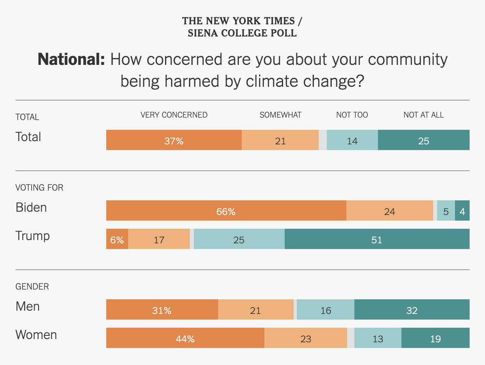
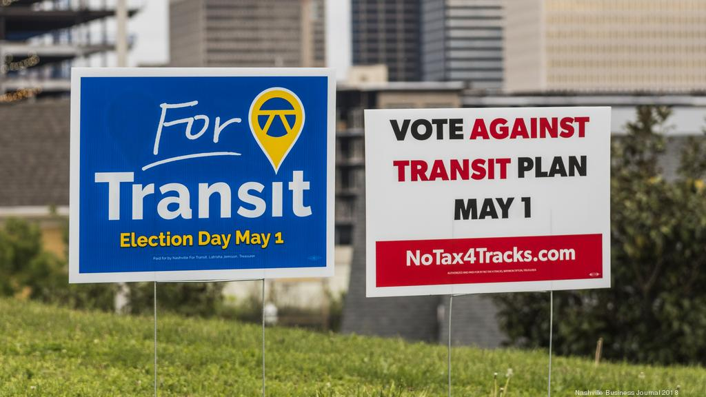
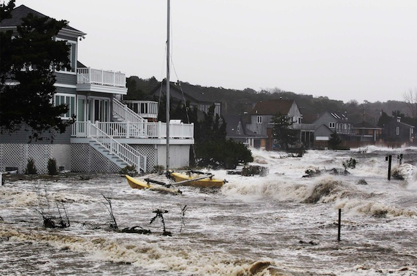
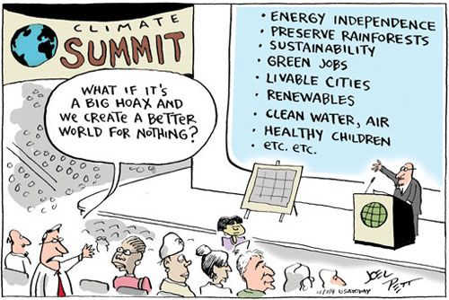

By now, I would bet that everyone knows what climate change is and has developed some basic opinion about it. I want to look into the cases where someone might want to openly deny that climate change exists. I know it seems like a simple "you either believe it or you don't" situation, but I found that there's a little more to it than just refusing to believe in the science.

I'll put these "deniers" into 3 categories:

1. They just don't believe in the science
2. They don't want to believe it because it will hurt their business
3. They believe it but don't care about it because it won't affect them

 

### 1. They just don't believe in the science

Although they might seem to make up the bulk of the deniers, I'm actually not going to touch this. I think people in this category are most likely getting influenced in some way by someone in the other two categories which is more interesting.

### 2. They don't want to believe it because it will hurt their business

We often see people who are extremely successful in business denying that climate change exists. An initial reaction to this might be that they must be dumb and they're not looking at the data correctly. But chances are, they're not dumb and the business they're operating in would suffer greatly if we were to act on these scientific findings. They most likely actually do believe in climate change, but they don't want **you** to believe it because it could bring about regulation that would hurt their business.

Oftentimes this deceit is pretty obvious. For example, for all of the changes the Trump Administration made in environmental politics the reasoning was made relatively clear:

- Rolled back the Clean Power Plan, which required the energy sector to cut carbon emissions by 32 percent by 2030 because it created "unfair burdens on the power sector and a war on coal".
- Loosened regulations around toxic air pollution and methane flares
- Removed an executive order (passed by Obama) that required federally funded projects to factor rising sea levels into construction
- Reduced 2 national monuments in Utah and opened them for mining and drilling companies

All of their changes are clearly for the benefit of businesses with no regard to what environmental consequences they could create.
 
 

On the other hand, some efforts are less obvious and meant to silently sway public opinion.

**For Example:**

About a year ago, I remember reading an article about a proposition in Phoenix, Arizona to expand its light rail system. It was to be extended into a poorer and more black and hispanic part of the city, allowing for better accessibility for low income households.

In my mind, I've always thought that it was strange that the public transportation in pretty much all of the U.S. was so scarce, and bad when it was available. It seems like a no brainer to try to make public transportation better; afterall, multiple studies have shown these benefits of public transportation:

- [x] increase accessibility to jobs, training, childcare etc.
- [x] reduce air pollution (buses emit 20% less carbon monoxide, 10% as much hydrocarbons, and 75% as much nitrogen oxides per passenger mile than an automobile with a single occupant)
- [x] benefit communities financially, every $1 invested generates $4 in economic returns, 50,000 jobs are created and supported, more money is saved by not needing to own a vehicle
- [x] reduce traffic congestion

If it bring so many benefits to communities, why would people vote 'no' on increasing public transportation?

Enter Americans for Prosperity, a libertarian-conservative political advocacy group present in 35 states, including Arizona, that was founded and funded by oil billionaires Charles and David Koch (aka the Koch brothers).

Using the Kochs' data operation called i360, which profiles Americans based on their voter registration information, consumer data and social media activities, Americans for Prosperity was able to target voters who were most likely to engage on this issue and whose minds they could potentially change. They split up into groups going door to door in Phoenix asking, “Do you agree that raising the sales tax to the highest rate in the nation must be stopped? Can we count on you to vote with us on the transit plan?”.

Americans for Prosperity argues that public transit plans waste taxpayer money on unpopular, outdated technology like trains and buses just as the world is moving toward cleaner, driverless vehicles. Stating that “If someone has the freedom to go where they want, do what they want, they’re not going to choose public transit”. This group opposes public investment in transit, but it still supports spending tax money on highways.

Although the initial goal of the prop was to create a new line for the light rail, the actual language of the referendum stated that this vote was actually to discontinue future light rail construction in the city. Essentially, a vote "yes" on Proposition 105 would **prohibit all future light rail construction** in Phoenix, Arizona, while "no" would leave the funds allocated to light rail expansion to existing charter provisions and city codes. Ironically, Scot Mussi, president of the Koch-funded Arizona Free Enterprise Club, helped draft the language for the proposition.

Proposition 105 in Phoenix, Arizona was rejected in a 62-to-38 percent vote! Unfortunately, this isn't the only city that Americans for Prosperity has targeted.
This has happened in cities and counties across the U.S including Little Rock, Arkansas, southeast Michigan, central Utah, and in Nashville, Tennessee and the results were not so positive.

Now the question is why?? Why would these two brothers spend so much effort and money to stall and halt America's public transportation systems?

It turns out that one of the mainstay companies of Koch Industries, the Kochs’ conglomerate, is a major producer of gasoline and asphalt, and also makes seatbelts, tires and other automotive parts. This all boils down to their financial interests, which benefit greatly from automobiles and highways.

To put some finances into perspective, the Koch Family is the second wealthiest in the world with a combined net worth of \$100 billion. Needless to say, they have a lot of skin in the game and are clearly motivated to keep and continue to increase their wealth. They pour money into super PACs, think tanks, and grass-roots activist organizations, such as Americans for Prosperity, to drive their influence. (If you're interested in learning more about the Koch Brothers and other radial right billionaires, check out [Dark Money](https://www.amazon.com/Dark-Money-History-Billionaires-Radical/dp/0307947904) by Jane Mayer). Their ability to silently influence voters away from solutions meant to help the general public and the planet is just one example of a business ensuring their own safety with disregard to anyone elses.
 

### 3. They believe it but they don't care because it won't affect them

There is a slight overlap here, the people in #2 usually are in this category as well.

The general concept is that people in this category are unfazed by the effects of climate change because they believe they have the money to either avoid it (by moving inland or away from the area) or pay for elite, private insurance to cover the cost of the damages. This follows the common misconception of, "I'm safe if I'm able to afford an AC unit". The AC unit might be able to make your home colder on warm days, but if the effects of climate change get exponentially worse as the degrees increase, we'll be dealing with a lot more than just warmer temperatures.

This sentiment of buying your own safety has already been seen in some responses to natural disasters in the U.S.: Naomi Klein outlines an example with the disaster relief following Hurricane Sandy in 2012. It was the strongest hurricane of the Atlantic hurricane season, killing 233 people (72 in the U.S.) and inflicting nearly \$70 billion in damages across eight countries from the Caribbean and Canada. Typically when a natural disaster happens that affects the U.S., the government will pass some type of Disaster Relief Package to help with recovery and repairs (similar the covid stimulous packages in 2020). Americans for Prosperity, the Koch-backed organization mentioned above, launched a campaign to block the federal aid package from going to states who suffered from Hurricane Sandy. The director of AFP's New Jersey Chapter stated, "We need to suck it up and be responsible for taking care of ourselves".

How much money do we need to have to protect ourselves from the increasing hurricanes, wild fires and floods caused by climate change? Will a middle class family be able to afford it, or will only the rich and wealthy be safe?

### Povery Multiplier

Climate change is projected to be poverty multiplier. The IPCC 1.5-Degree Special Report states, "Its impacts are expected to make the poor poorer and the total number of people living in poverty greater. The 0.5°C rise in global temperatures that we have experienced in the past 50 years has contributed to shifts in the distribution of plant and animal species, decreases in crop yields and more frequent wildfires."

The higher the degrees, the greater the chance and percentage of our population will experience food and water insecurities, adverse health impacts and economic loss. This is why most climate change action plans touch on reducing poverty and inequalities. The deep changes required to curb the effects of climate change will need to redefine the underlying logic of our economy, and in doing so, will give us the opportunity to eradicate poverty and reduce inequalities.

### Radical?

Many deniers recognize this and fear that the political implications would be catastrophic and successfully advance many of the causes the "left" believe in: redistribution of wealth, higher taxes, greater government intervention and regulation. A member of The Heartland Institute, an American conservative think tank, stated that for the left, "Climate change is the perfect thing ... it's the reason why we should do everything the left wanted to do anyway".

I've actually never heard of this reasoning until recently, and although I find it to be surprising, I do see where they're coming from given the polarized current state of our nation. But if we can remove this existing lense and isolate the problem away from these narratives, we can see that this isn't an us vs. them issue, it's just us battling ourselves. Understanding where all of these influences are coming from help us paint what our current situation involves and what blockers we'll need to account for within each potential solution. Even though the changes will need to be dramatic, they will allow us to take responsibility while allowing us to redefine our systems.

 

